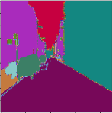
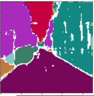
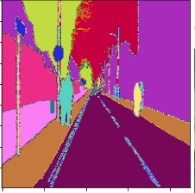
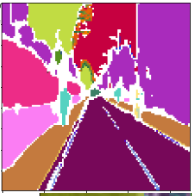
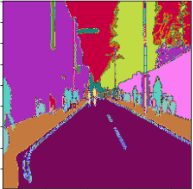
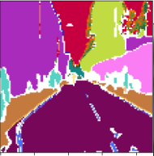

# Semantic image segmentation
## Model
UNET model is implemented with ResNet-34 backbone.

## Dataset
Camvid dataset
## Results

.png)

Train loss vs validation loss over 200 epochs. 
I used BCE + dice loss.

Original mask (left), generated mask (right)
